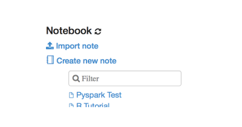

## Overview

This example installs, configures and runs [Zeppelin](https://zeppelin.apache.org) on a BigInsights cluster without requiring root privileges.  Two reasons for running Zeppelin may be:

- to provide data scientists with notebook functionality
- to provide example code in the form of notebooks for services such as hbase


## User experience

Users will gain the most from these examples if they are:

- Comfortable using Windows, OS X or *nix command prompts

## Example Requirements

- You meet the [pre-requisites](../../README.md#pre-requisites) in the top level [README](../../README.md)
- You have followed the [setup instructions](../../README.md#setup-instructions) in the top level [README](../../README.md)

## Run the example

### Install Zeppelin

To install Zeppelin, in a command prompt window:

   - change into the directory containing this example and run gradle to execute the example
      - `./gradlew Install` (OS X / *nix)
      - `gradlew.bat Install` (Windows)
   - some output from running the command on my machine is shown below 

```bash
biginsight-bluemix-docs $ cd examples/Zeppelin
biginsight-bluemix-docs/examples/Zeppelin $ ./gradlew Install
```

### Uninstall Zeppelin

To uninstall Zeppelin, in a command prompt window:

   - change into the directory containing this example and run gradle to execute the example
      - `./gradlew Uninstall` (OS X / *nix)
      - `gradlew.bat Uninstall` (Windows)
   - some output from running the command on my machine is shown below 

```bash
biginsight-bluemix-docs $ cd examples/Zeppelin
biginsight-bluemix-docs/examples/Zeppelin $ ./gradlew Uninstall
```

### Run Zeppelin

First install Zeppelin.  Then to run Zeppelin, in a command prompt window:

   - change into the directory containing this example and run gradle to execute the example
      - `./gradlew Run` (OS X / *nix)
      - `gradlew.bat Run` (Windows)
   - some output from running the command on my machine is shown below 

```bash
biginsight-bluemix-docs $ cd examples/Zeppelin
biginsight-bluemix-docs/examples/Zeppelin $ ./gradlew Run
:Run
Strict host key checking is off. It may be vulnerable to man-in-the-middle attacks.
bicluster#0|Zeppelin is running                            [  OK  ]
bicluster#0|
> Building 0% > :Run

SSH forwarding localhost:51174 -> BigInsights zeppelin
Access zeppelin at: http://localhost:51174.
Press ENTER to quit.
```

Follow the instructions output by the Run command.  


### Test Zeppelin with Pyspark

First run Zeppelin.  In the brower window, you should see a list of notebooks:



- Click on the 'Pyspark Test' notebook to open it
- Click on the run button in the notebook windows to execute the notebook code 
- Verify the row count output from spark equals the expected row count


## Limitations

- currently zeppelin binds to a fixed port on the cluster mastermanager node (8080) this means only one user can run zeppelin.  this will be fixed in future releases
- current only the spark and bash interpreters are configured
- currently only basic zeppelin spark configuration is performed: see [zeppelin_install.sh](./zeppelin_install.sh) for details
