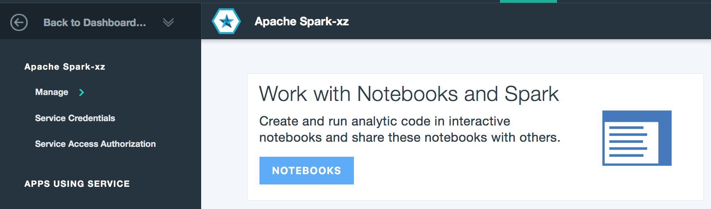
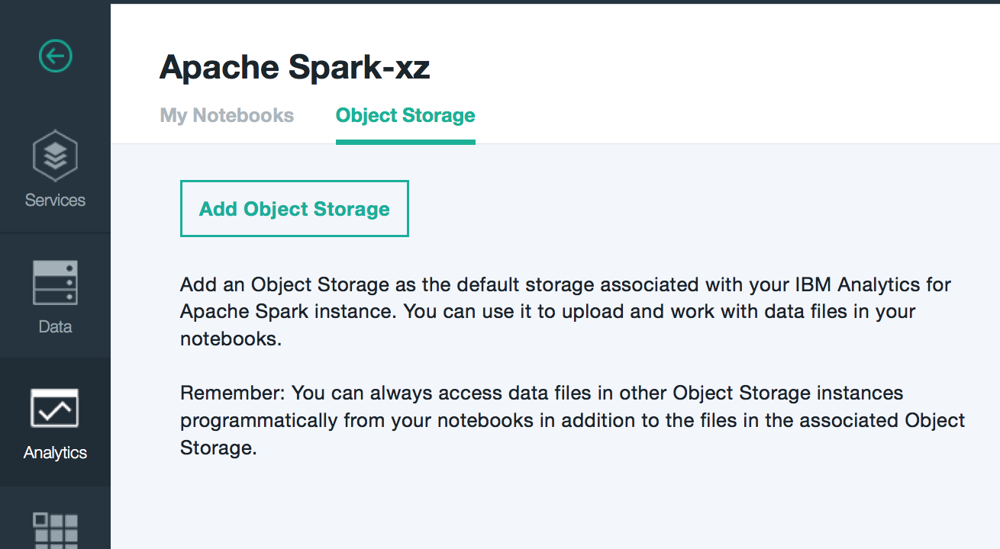
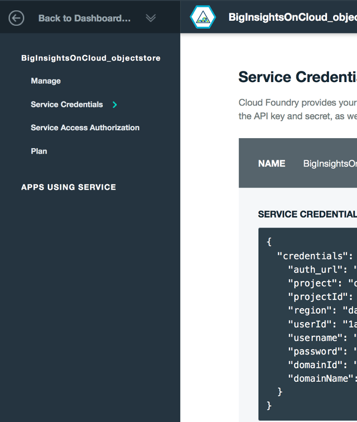

Login to Bluemix and set the region.

Now click on Catalog and search for spark and click on the Spark icon.

Click create for a Spark personal instance.

Click on Notebook.

Click on Object Storage.

Click on Object Storage.

 
Create new Object Storage or select existing.  Select Service Credentials.

Download the exporttoswift.sh file.  

Enter your BigInsights username and hostname.

Enter the credentials from Object Storage Service Credentials Screen.

Download the exporttoswift.py file and LICENSE file.

Run `bash ./exporttoswift.sh`.

If you have no errors, verify that you have a new Object Store container in bluemix with the wordcounts.

